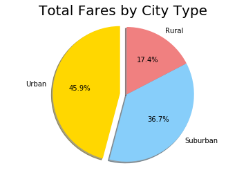

# Pyber Data

# Analysis
* Rural cities take in 17.4% of total fares despite only giving 5.2% of the total rides
* Urban cities have a wider distribution of number of drivers than Suburban or Rural cities
* The ratio of drivers to riders across all types of cities is approximately logarithmic


```python
import matplotlib.pyplot as plt
import numpy as np
import pandas as pd
```


```python
file1 = "city_data.csv"
file2 = "ride_data.csv"

city_data = pd.read_csv(file1)
ride_data = pd.read_csv(file2)
```


```python
#Average Fare ($) Per City
city_group = ride_data.groupby("city")
avg_fare = city_group["fare"].mean()

#Total Number of Rides Per City
ride_count = city_group["ride_id"].count()

#Total Number of Drivers Per City & City Type (Urban, Suburban, Rural)
city_df = city_data.set_index("city")

city_df["Average Fare"] = avg_fare
city_df["Ride Count"] = ride_count
```


```python
urban = city_df[city_df["type"] == "Urban"]
suburban = city_df[city_df["type"] == "Suburban"]
rural = city_df[city_df["type"] == "Rural"]
```


```python
plt.figure(figsize=(20,10))

marker_urban = urban["Average Fare"] ** 2.2
marker_suburban = suburban["Average Fare"] ** 2.2
marker_rural = rural["Average Fare"] ** 2.2

colors = ["gold", "lightskyblue", "lightcoral"]

urban_handle = plt.scatter(urban["driver_count"], urban["Ride Count"], marker="o", c=colors[0], \
                           s = marker_urban, edgecolors="black", alpha = .70, label = "Urban")
suburban_handle = plt.scatter(suburban["driver_count"], suburban["Ride Count"], marker="o", c=colors[1], \
                              s = marker_suburban, edgecolors="black", alpha = .70, label = "Suburban")
rural_handle = plt.scatter(rural["driver_count"], rural["Ride Count"], marker="o", c=colors[2], \
                           s = marker_rural, edgecolors="black", alpha = .70, label = "Rural")

plt.title("Pyber Data", size=40)
plt.xlabel("Number of Drivers", size=20)
plt.ylabel("Number of Rides", size=20)

lgnd = plt.legend(loc="lower right", fontsize="x-large", fancybox=True, shadow=True)
lgnd.legendHandles[0]._sizes = [80]
lgnd.legendHandles[1]._sizes = [80]
lgnd.legendHandles[2]._sizes = [80]

print("Note: Size of point shows average fee in city")
plt.show()
```

    Note: Size of point shows average fee in city
    


```python
#% of Total Fares by City Type
city_type = ["Urban", "Suburban", "Rural"]
total_fares = [urban["Average Fare"].sum(), suburban["Average Fare"].sum(), rural["Average Fare"].sum()]
colors = ["gold", "lightskyblue", "lightcoral"]
explode = (0.1, 0, 0)

plt.pie(total_fares, explode=explode, labels=city_type, colors=colors, autopct="%1.1f%%", shadow=True, startangle=90)

plt.title("Total Fares by City Type")
plt.axis("equal")
plt.show()
```





```python
#% of Total Rides by City Type
city_type = ["Urban", "Suburban", "Rural"]
total_rides = [urban["Ride Count"].sum(), suburban["Ride Count"].sum(), rural["Ride Count"].sum()]
colors = ["gold", "lightskyblue", "lightcoral"]
explode = (0.1, 0, 0)

plt.pie(total_rides, explode=explode, labels=city_type, colors=colors, \
        autopct="%1.1f%%", shadow=True, startangle=90, pctdistance=.8)

plt.title("Total Rides by City Type", size = 20)
plt.axis("equal")
plt.show()
```


```python
#% of Total Drivers by City Type
city_type = ["Urban", "Suburban", "Rural"]
total_drivers = [urban["driver_count"].sum(), suburban["driver_count"].sum(), rural["driver_count"].sum()]
colors = ["gold", "lightskyblue", "lightcoral"]
explode = (0.1, 0, 0)

plt.pie(total_drivers, explode=explode, labels=city_type, colors=colors, \
        autopct="%1.1f%%", shadow=True, startangle=90, pctdistance=.8)

plt.title("Total Drivers by City Type", size = 20)
plt.axis("equal")
plt.show()
```


